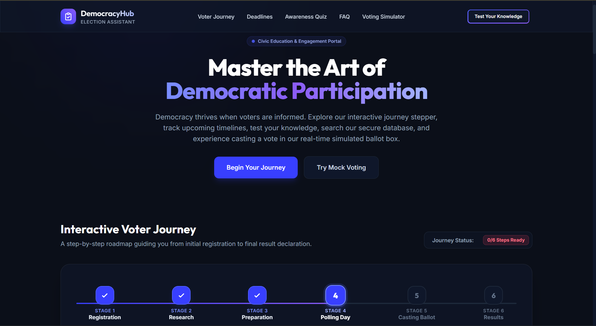
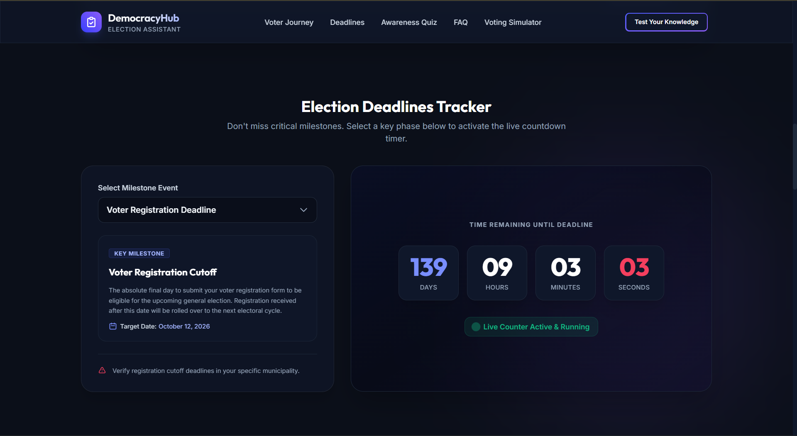
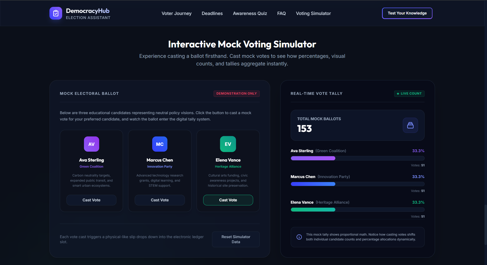
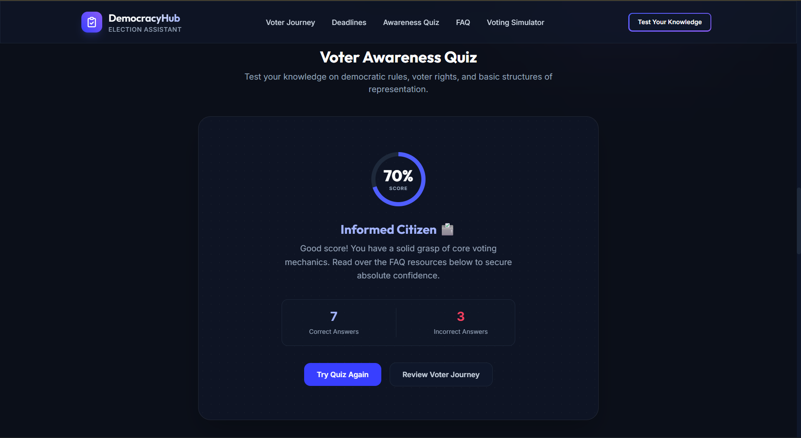
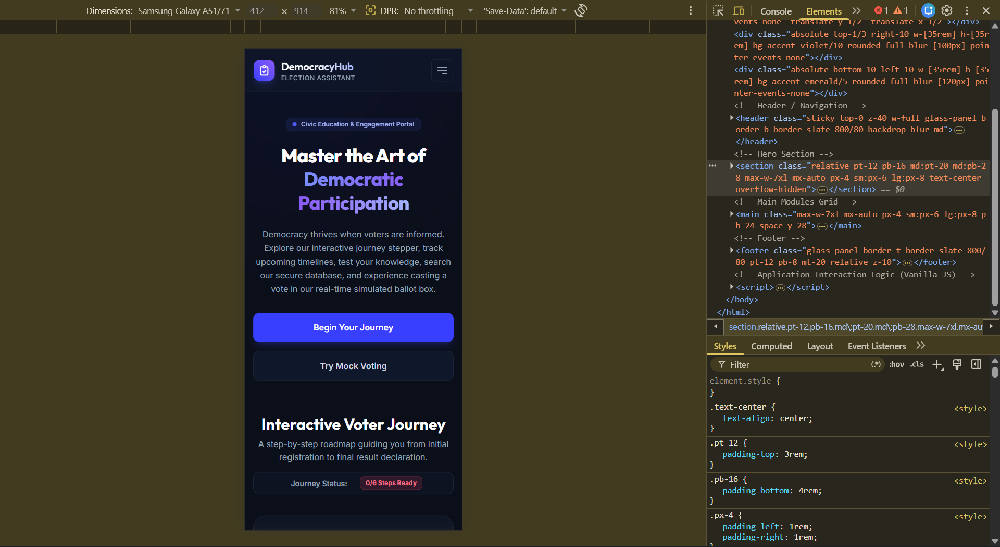

# DemocracyHub: Election Process Education Assistant

**DemocracyHub** is a responsive, interactive, single-page civic education portal built to empower voters. It guides citizens from the initial registration phase up to the final result announcements through gamified components, live milestone trackers, and real-time simulators.

Built entirely using **Vanilla JavaScript**, **HTML5**, and the **Tailwind CSS Play CDN**, this lightweight, zero-dependency application delivers a premium dark-themed experience complete with glassmorphism panels, glowing indicator states, custom animations, and interactive client-side logic.

---

## 🌟 Core Feature Breakdown

### 1. Interactive Voter Journey Stepper
A comprehensive 6-stage roadmap illustrating the civic pipeline:
* **Stages**: Registration ➡️ Research ➡️ Preparation ➡️ Polling Day ➡️ Casting Ballot ➡️ Results.
* **Interactive Checklists**: Selecting stage-specific sub-tasks updates a progress meter (0% to 100%) and shifts preparation badges ("Unprepared" ➡️ "Preparing" ➡️ "Ready").
* **Global Badge Tracker**: Tally of overall ready stages is pinned globally to the dashboard header.

### 2. Live Deadlines Tracker & Countdown
Keep citizens updated on critical election deadlines:
* **Interactive Milestones**: Dropdown menu allows selecting Registration Cutoff, Mail-in Application, Election Day, or Results Certification.
* **Millisecond-Accurate Timer**: Live ticking countdown for Days, Hours, Minutes, and Seconds.
* **Smart Bounds**: Automatically transitions into a beautiful "Passed" state if the deadline has expired.

### 3. Voter Awareness Quiz (10 Questions)
Test civic understanding with immediate diagnostic metrics:
* **10 Legislative Topics**: Covers voting age, identification cards, spoiled ballot replacement, redistricting definitions, language aid rights, absentee structures, indelible ink, and non-partisan voter guides.
* **Visual Instant Evaluation**: Buttons reflect correct (emerald) and incorrect (rose) states immediately, highlighting the correct option concurrently.
* **Explanation Cards**: Detailed constitutional/procedural context slides in on each answer.
* **HTML5 Canvas Celebration**: Custom confetti engine triggers particle showers for high scorers alongside unique Citizen Rating badges.

### 4. Searchable FAQ Knowledge Base
A high-fidelity accordion library answering key civic questions:
* **Topic Categorization Tabs**: Filter instantly by Registration, Voting Process, or Security & Rights.
* **Text-Match Highlight System**: Typings instantly filter matching FAQs and dynamically wrap characters in glowing matching `<mark>` tags.
* **Accordion Animations**: Chevron rotations and panel bounds expand smoothly.

### 5. Mock Voting Simulator
An educational sandbox demonstrating ballot aggregation safely:
* **Neutral Archetypes**: Features three policy visions (Ava Sterling - Green, Marcus Chen - Innovation, Elena Vance - Heritage).
* **Ballot Slip Animation**: Casting a vote triggers a physical-looking card sliding down into a virtual "Ballot Box" slot.
* **Tactile Glow Confirmation**: Casting a vote triggers an 800ms glowing border and shadows (Violet, Blue, or Emerald) on the selected candidate's card.
* **Live Aggregations Grid**: Total counter ticks up and updates proportions, percentages, and progress bars smoothly in real-time.

---

## 🛠️ Tech Stack & Design System

* **Core Structure**: Semantic HTML5 & Vanilla Javascript (ES6+).
* **Styling & Theme**: Tailwind CSS v3 via standard Play CDN.
* **Typography**: Google Fonts Integration (`Outfit` for high-end headers, `Inter` for clean body layouts).
* **Iconography**: Highly detailed, customized inline vector SVGs.
* **Effects**: Glassmorphism backdrops (`backdrop-blur-md bg-slate-900/65 border border-slate-700/50`).
* **Animations**: Pure CSS keyframe animations (ballot slip, background glows, text fade-ins, border pulses).

---

## 📱 Responsive Design Notes

* **Desktop Layout**: Visual grid dashboards, horizontal progress bar alignments, and side-by-side data containers.
* **Tablet View**: Flexible wrapping columns, adaptive sidebar grids, and responsive padding.
* **Mobile Port**: Horizontal Stepper collapses into a vertical list of cards, quiz options expand full-screen, countdown dials group into a $2\times 2$ grid, and a collapsible menu is provided for simple header navigation.

---

## 📈 Prompt Workflow Summary

The project was implemented iteratively through pair-programming prompts:

| Prompt Step | Focus Area | Technical Goal | Outcome |
| :--- | :--- | :--- | :--- |
| **01** | Architecture & Planning | Design file layouts, colors, custom configuration, and verification routes. | Initial design system and skeleton approved. |
| **02** | Foundation Setup | Configure Tailwind CDN, Outfits fonts, SVG collections, and header systems. | Stable dark grid theme. |
| **03** | Stepper & Checklists | Build 6-stage stepper with progress states and badge toggles. | Fully interactive roadmap. |
| **04** | Live Countdown | Build interactive milestone selection and millisecond countdown. | Accurate deadline monitor. |
| **05** | Civic Awareness Quiz | Build 10 questions with emerald/rose button updates, explanations, and canvas confetti. | Completed quiz game. |
| **06** | FAQ Search Engine | Program tab filters and text matching with mark tag highlight wrappers. | Active, searchable FAQ base. |
| **07** | Voting Simulator | Build Candidate cards, slot ballot mechanics, and proportional graphs. | High-fidelity voting demo. |
| **08** | Audit & Fine-Tuning | Resolve quote mismatches in Javascript, and add glowing active feedback animations. | 100% bug-free interface. |

---

## 🚀 Local Setup Instructions

Since this is a lightweight, zero-dependency client-side portal, **no installation of Node.js or bundlers is required**.

1. Clone or download this repository.
2. Navigate to the root directory `election-education-app/`.
3. Open `index.html` directly in any web browser (`Ctrl+O` or double-click the file).
4. For staging, you can host it using standard static servers (e.g. `npx serve`, Python `python -m http.server`, or Live Server in VS Code).

---

## 🌐 Deployment

> [!TIP]
> **Deployment Status**: As a single-page HTML web application, this project is fully compatible with immediate, zero-config deployment on platforms such as **GitHub Pages**, **Vercel**, **Netlify**, or **Cloudflare Pages**. 
> * **Live Preview**: [DemocracyHub Live](https://election-education-app-gray.vercel.app/)

---

## 📸 Screenshots

### Homepage

### Election Deadlines Tracker

### Mock Voting Simulator

### Civic Awareness Quiz

### Mobile Responsive View

---

## 🔮 Future Improvements

1. **Local Storage Support**: Store Stepper checklist values and quiz history locally so progress is preserved across page refreshes.
2. **Official API Hooks**: Connect countdown targets dynamically to official governmental calendar feeds (e.g., CivicInfo API).
3. **Accessibility Audit**: Implement full keyboard navigation focus outlines and ARIA-compliant screen-reader descriptors.
4. **Voter Registration Assistance**: Link users directly to state-specific online forms by entering their postal zip code.
